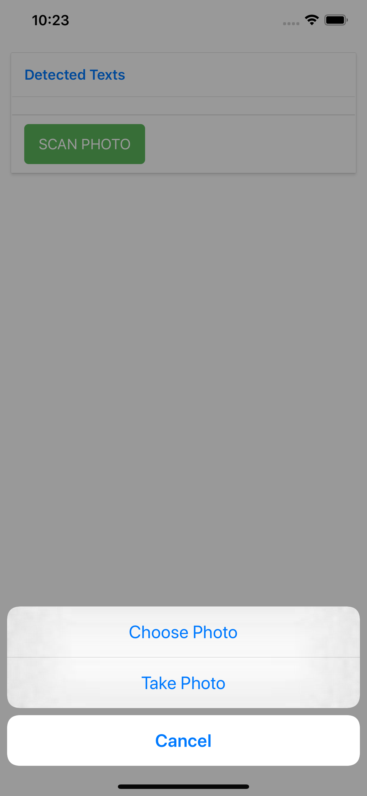
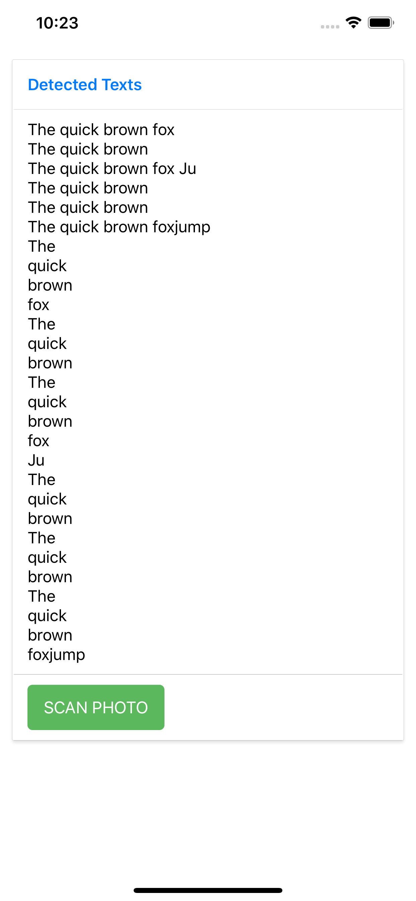

# Expo React Native App
# AWS Rekognition API

## AWS API Keys
You need to update aws-config.js file with your AWS Api Access Keys
```
export default AWS_CONFIG = {
    region: 'us-west-1',
    credentials: {
        accessKeyId: '<Your AWS Access Key>',
        secretAccessKey: '<Your AWS Secret Access Key>'
    }
};
```
Install depedencies
```
npm install
```
Run the app
```
npm start
or
expo start
```





